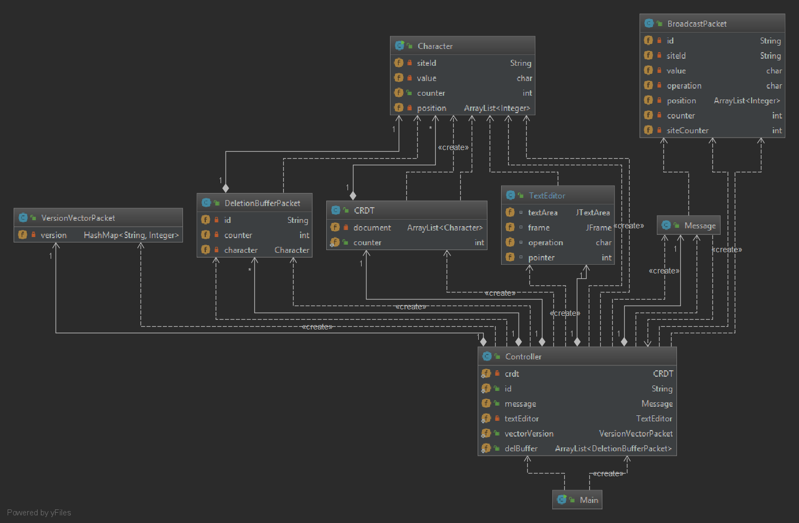

# Peer to Peer Collaborative Editing

## Petunjuk Penggunaan Program
Jalankan *command* berikut di terminal anda
```
java -jar peer2peer-collaborative-editing.jar
```

## Pembagian Tugas
- 13516019 (40%) : CRDT, GUI Text Editor, UDP connection
- 13516031 (30%) : Version Vector, Deletion Buffer 
- 13516151 (30%) : Version Vector, Deletion Buffer

## Laporan
### Cara Kerja Program dan Desain Program
Cara kerja program kami ialah :
1. Text Editor menerima input berupa karakter yang di*insert* atau di*delete*.
Ketika melakukan sebuah perubahan, CRDT akan di*update* baik counter maupun *Array List* karakternya.
2. Text Editor menampilkan perubahan tersebut lokal 
3. Lalu perubahan karakter tersebut dikirimkan menggunakan UDP. Data yang 
dikirimkan ialah karakter yang diubah, lokasi dari karakter, operasi yang dilakukan, dan siteID nya
4. Peer2 yang sudah terkoneksi dengan ip multicast akan menerima paket yang dikirimkan.
Karena paket yang dikirimkan berbentuk *byte*, maka perlu di*convert* kembali menjadi kelas objek kembali
5. Peer2 melakukan update CRDT sesuai dengan paket yang diterima
6. Peer2 melakukan update pada Text Editor
<br><br>


### CRDT, Version Vector, dan Deletion Buffer
#### CRDT
CRDT mempunyai fungsi utama insert, delete, dan sort. Ketika CRDT
memanggil ketiga fungsi tersebut, maka counter dari CRDT akan di 
*incerement* dan diupdate. Fungsi dari *insert* ialah untuk menyisipkan 
atau memasukkan sebuah karakter ke dalam sebuah *Array List* yang nantinya 
akan dimasukkan ke dalam GUI. Karakter yang dimasukkan akan disimpan 
juga posisi, siteId, dan counternya. Fungsi *delete* pada CRDT berguna untuk
menghapus karakter dari *Array List* yang nantinya akan dihapus juga
dari Text Editor. Fungsi *sort* pada CRDT untuk melakukan *sort* karakter 
pada *Array List* agar tercetak sesuai posisi di Text Editor. 

#### Version Vector 
Kelas Version Vector berfungsi untuk menyimpan counter setiap siteID.
Kelas Version Vector ini menyimpan HashMap untuk menyimpan counter dan siteID.
Counter dari setiap siteID akan di*update* ketika dia menerima paket 
dari siteID lain dan siteID nya sendiri akan di*update* ketika dia sendiri melakukan
*insert* atau *update*.

#### Deletion Buffer
Fungsi deletion buffer dipakai pada kelas *Controller* untuk menyimpan 
karakter yang di*delete* ketika counter karakter yang di delete lebih
besar. Counter tersebut di cek pada version vector.

### Analisis
Menurut kami, program yang kami buat sudah cukup baik untuk melakukan
*peer to peer collaborative editing*. Program kami mampu menangani
*insert* dan *delete* baik di awal, tengah, dan akhir dari susunan
karakter. Tetapi cursor pada Text Editor tidak bergerak sesuai insert atau delete.
Untuk solusi yang lebih baik, menurut kami untuk program ini dapat 
di tingkatkan dengan menambahkan *handling buffer* setiap peer menerima 
operasi baik *insert* maupun *delete*.

### Kasus Uji
- Melakukan insert karakter pada posisi kursor awal 
- Melakukan delete karakter pada posisi kursor akhir 
- Melakukan insert karakter di tengah kedua karakter lainnya
- Melakukan delete karakter di tengah kedua karakter

### Screenshot / Video Demo
https://drive.google.com/drive/folders/1aEqooAN8T74g3mebCAwkqxpww_aahOKr?usp=sharing
